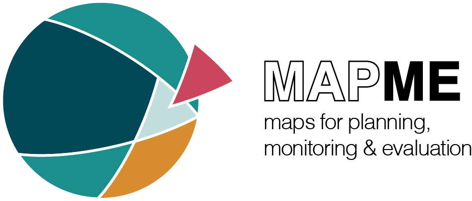

**About**

This package is a collection of functions used to download, pre-process and conduct analysis of Sentinel-2 L1C data in the process of de- / afforestation monitoring and planning. Data is downloaded from a public data bucket at GoogelCloud. Users thus need a valid Google account to be able to download the package. Additionally gsutils needs to be installed on your machine. Installation instructions can be found [here](https://cloud.google.com/storage/docs/gsutil_install). The package provides functionality for cloud masking, calculation of a high number of vegetation indices,  and spatio-temporal aggregations suiting different user needs. Under the hood the R package [gdalcubes](https://github.com/appelmar/gdalcubes_R) provides comprehensive and highly-efficient utilities for image warping and pixel-based calculations. Finally, common zonal statistics can be calculated for polygons across the time-dimension of the input raster files. 

**Tutorial**

The tutorial for the usage of the **mapme.vegetation package** can be found [here](https://mapme-initiative.github.io/mapme.vegetation/). Please visit
this page in order to get to know the API of mapme.vegetation.

**Installation**

In our installation instruction we assume that you are going to use R Studio as an IDE. You need to have some software pre-installed software to be able to install the sen2tool package.

- download and install R >= 3.5.x from https://cran.rstudio.com/
- download and install R Studio from https://rstudio.com/products/rstudio/download/#download
- download and install Rtools from https://cran.r-project.org/bin/windows/Rtools and make Rtools available on the PATH variable
- install the devtools and git2r packages with 'install.packages(c("devtools", "git2r"))'

This package can be installed directly by using the `remotes` package by entering the following command:

`remotes::install_github("mapme-initiative/mapme.vegetation")`

Additionally, we ship this package with a Dockerfile which can be used to run the packages and its dependencies as a container. When `cd`ing into the repository,  building and running the image is as simple as:

`docker build -t mapmeVegetation:latest .`

`docker run -d -p 8787:8787 -e USER=myuser -e PASSWORD=mypassword mapmeVegetation`


**gsutil**

It is **not** possible to download any data without a login to a valid Google account in advance. Follow the instructions outlined here:

- run ```bash  gcloud init``` from the terminal in R Studio
- follow the instructions there to log into a Google account
- create a new project ID or change to an already existing one
- start downloading data afterwards


**Note**

When using the provided Dockerfile to run the package in an container users might run into issues concerning write permissions to directories. In the case a user does not have permission to write into a specified folder the Download will fail. In these cases the users should contact their administrator for writting permissions or log into the container as a root user and change the permissions manually:

`docker exect -it <container_name> bash`

followed by:

`chmod u+w <directory>`
